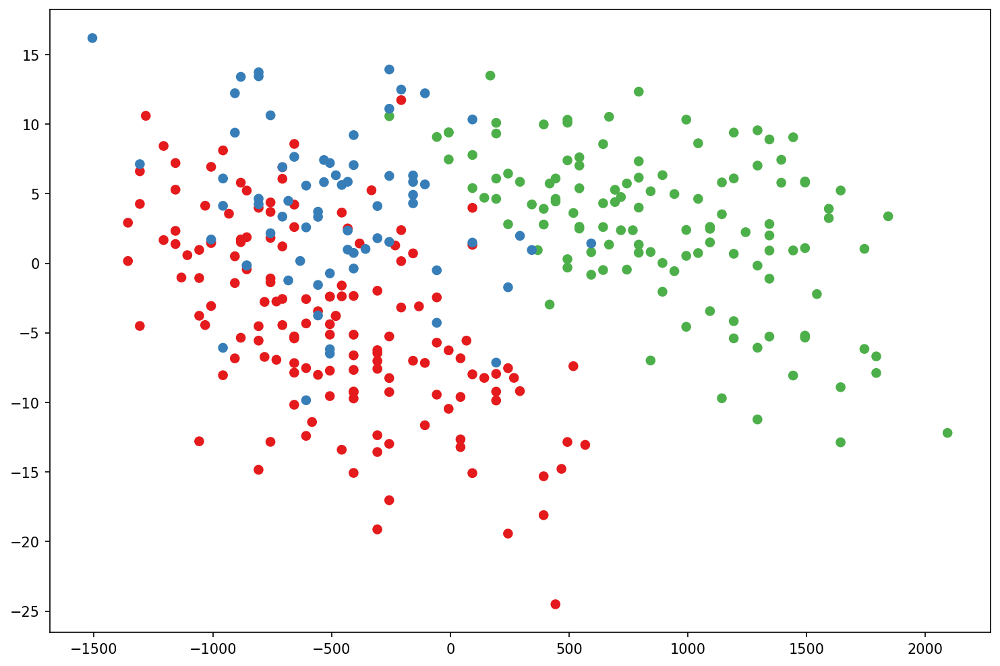
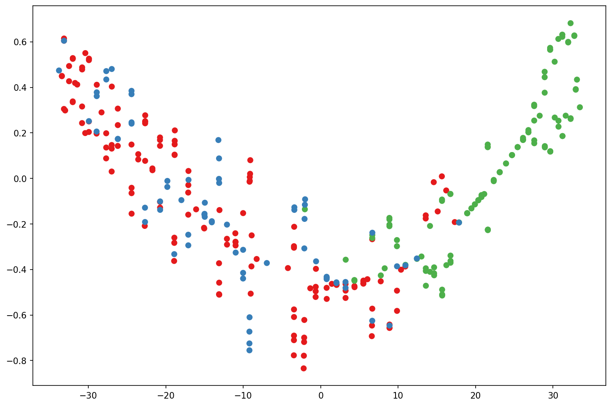
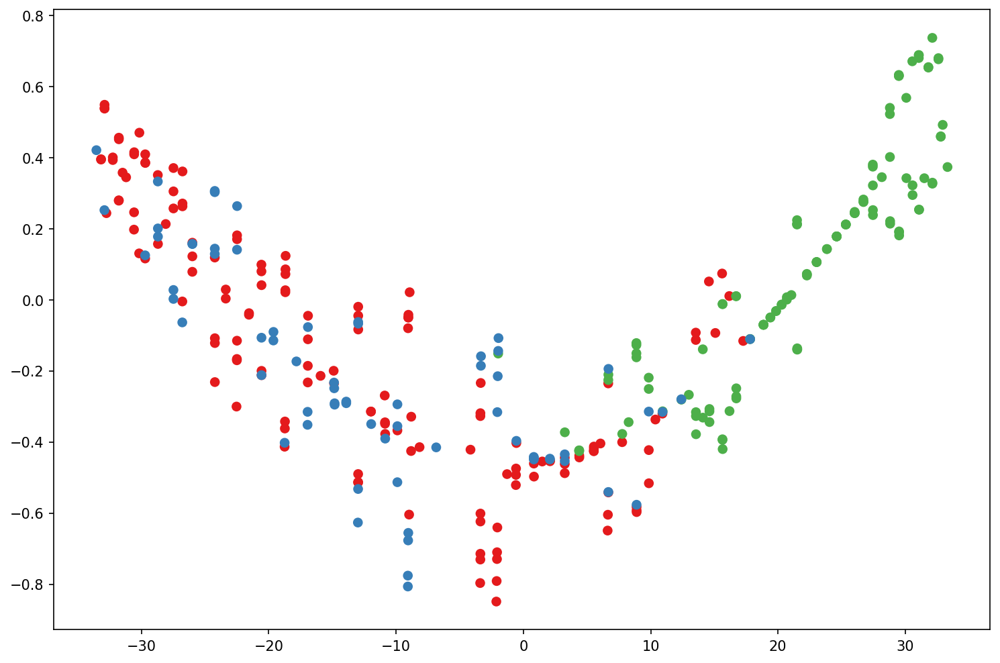

# PCA & t-SNE — Penguins

Dimensionality reduction and cluster visualization on the Palmer Penguins dataset using PCA, t-SNE, and t-SNE on PCA.

## Files
- `Principal_Component_Analysis_(PCA).ipynb` — main notebook
- `penguins.csv` — dataset (UTF-8)
- `pca_penguins.pkl`, `tsne_penguins.pkl`, `pca_tsne_penguins.pkl`, `cleaned_penguins.pkl` — artifacts

## Run
conda create -n dtsc680 python=3.11 -y
conda activate dtsc680
pip install numpy pandas matplotlib scikit-learn jupyter
jupyter notebook

## Results

## What I Learned

Through this project, I practiced one of the most important skills in applied machine learning, reducing high-dimensional data into meaningful visualizations. I learned how to:

- Clean and preprocess real-world data, including handling null values and encoding categorical variables.
- Use **Principal Component Analysis (PCA)** to reduce data dimensions while preserving variance.
- Apply **t-SNE** for nonlinear dimensionality reduction and visualize clusters that PCA might miss.
- Combine PCA and t-SNE to improve clustering performance and interpretability.
- Export trained transformations and intermediate results with `pickle` for reuse in downstream tasks.
- Document and version-control a complete data science workflow using Git and GitHub.

This assignment strengthened my ability to explore data structure visually and built intuition around when to use different dimensionality reduction techniques, essential skills for real-world machine learning workflows.

## Skills Demonstrated

- **Data Cleaning & Preprocessing:** Handling missing values, encoding categorical variables, and preparing data for modeling.
- **Dimensionality Reduction:** Applying both linear (PCA) and nonlinear (t-SNE) methods to reveal patterns and clusters in high-dimensional data.
- **Data Visualization:** Creating clear, interpretable scatter plots to visualize reduced dimensions and cluster separations.
- **Model Export & Reusability:** Saving models and transformed data with `pickle` for downstream machine learning workflows.
- **Version Control & Collaboration:** Using Git and GitHub for code versioning, documentation, and project sharing.
- **Reproducible Workflows:** Organizing files, documenting processes, and building reproducible data science pipelines.
